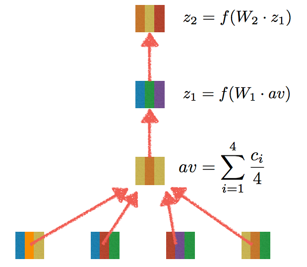

Variational Inference for Topic Models
=

Due: 17. Nov 2017

Overview
--------

For gaining a better understanding of deep learning, we're going to be
looking at deep averaging networks.  These are a very simple
framework, but they work well for a variety of tasks and will help
introduce some of the core concepts of using deep learning in
practice.

What's a DAN?
----------------

A deep averaging network was designed for text documents.  Each word
has a vector represenation.  We average this vector representation,
multiply it by a matrix, pass it through a nonlinearity (ReLU) and
then create a hidden layer.  If it was a good idea to do it once, we
do it again.  The number of times we do it is called the depth of the
network.

Finally, we have a final hidden layer.  We're going to use a softmax
function (no Gumbel parameter) to create the final multiclass
prediction for the network.

You can read more about the background and comparison with other
models in the [original
paper](https://cs.umd.edu/~miyyer/pubs/2015_acl_dan.pdf).

What you have to do
----------------

The assignment is relatively simple: you need to compute the
activations this network.  You don't need to derive the gradients, but
it would be good practice for you to do so.

For computing the activations, you'll need to access the parameters.
These can be gotten through the methods *get_w* and *get_b* inside the
DeepAveragingNetwork class.  There are unit tests as usual to make sure you're
on the right track.

Extra Credit
----------------=

For extra credit, initialize the word representations with word2vec,
GloVe, or some other representation.  Compare the final performance
based on these initializations *and* see how the word representations
change.

Writeup
----------------

No writeup in necessary unless you implement the extra credit.

AdaGrad
----------------

When you're doing gradient descent, some dimensions are more important
than others.  We won't be doing vanilla SGD; instead, we'll focus on
particular dimensions.  You should not need to modify the code to do
this.  You will not need to implement this, but we have provided a
class that rescales the dimensions as you do your updates.

Autodifferentiation and GPUs
----------------

I'm well aware that all of the cool kids are doing deep learning on
GPUs and with deep learning toolkits.  However, using toolkits makes
it harder to learn what's going on, and using GPUs makes programming
slightly more difficult.  To make everyone's life easier, we're going
to run these algorithms on the CPU.  Our data aren't too big, so it
should be fine.
